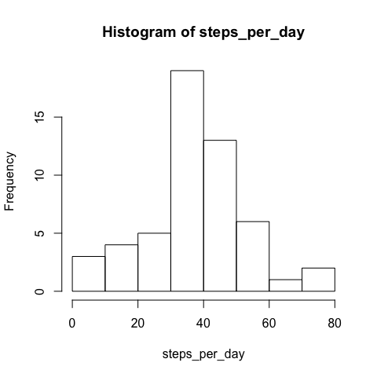
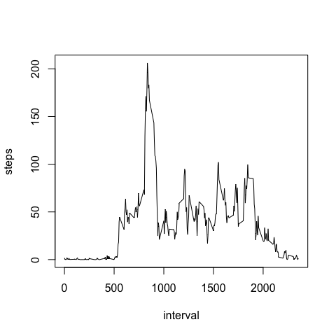
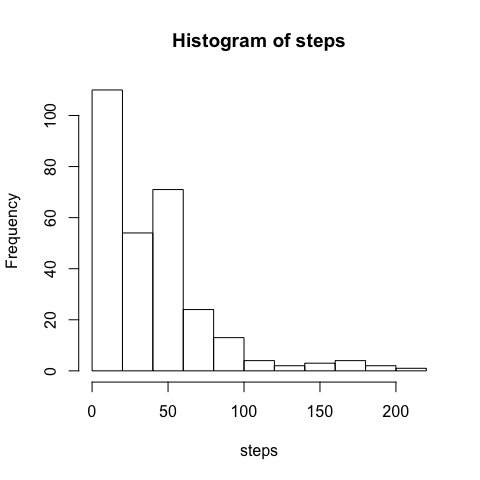
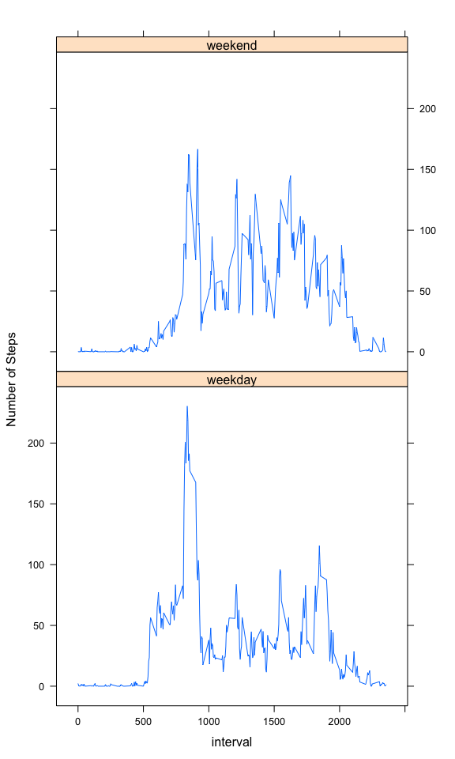

# Reproducible Research: Peer Assessment 1


## Loading and preprocessing the data

Unzip and load the file 


```r
unzip("activity.zip")
act <- read.csv("activity.csv",na.strings = "NA",stringsAsFactors = FALSE)
```


## What is mean total number of steps taken per day?

Compute the mean total number of steps taken for each day 

```r
steps_per_day<-tapply(act$steps,act$date,mean,na.rm=TRUE)
steps_median <- median(steps_per_day,na.rm=TRUE)
steps_mean <- mean(steps_per_day,na.rm=TRUE)
```

Histogram depicting the total number of steps taken each day


```r
hist(steps_per_day)
```

 

Median steps per day is 37.3784722
Mean steps per day is 37.3825996

## What is the average daily activity pattern?

Average daily patterns are observed by taking average for same time slots in a day across all the days.

```r
steps<-tapply(act$steps,act$interval,mean,na.rm=TRUE,simplify = TRUE)
df <- as.data.frame(steps)
df$interval <- as.numeric(rownames(df))
maximum_interval <- df[df$steps == max(df$steps),]$interval
```

Interval with maximum number of steps is 835

Plot the average daily activity patterns 

```r
with(df,plot(interval,steps,type="l"))
```

 


## Imputing missing values

Compute the missing cases and do the below steps.  

1. Fill them up by making a copy of the actual data frame.
2. Fill them by using the mean of no of steps in similar time interval across all days.


```r
missing_cases <- nrow(act[!complete.cases(act),])
com_act <- data.frame(act)
for( i in 1:nrow(com_act)){
  if(is.na(com_act[i,]$steps)){
    com_act[i,]$steps <- df[df$interval== com_act[i,]$interval,]$steps
  }
}
c_steps<-tapply(com_act$steps,com_act$interval,mean,na.rm=TRUE,simplify = TRUE)
steps_com_median <- median(c_steps,na.rm=TRUE)
steps_com_mean <- mean(c_steps,na.rm=TRUE)
```

No of missing cases are **2304**  
Stats with all missing steps filled  
**Mean = 37.3825996**  
**Median = 34.1132075**

Histogram of the filled data frame steps is presented below.

```r
hist(c_steps,xlab = "steps", main ="Histogram of steps")
```

 


Do these values differ from the estimates from the first part of the assignment? 

```
## [1] FALSE
```

What is the impact of imputing missing data on the estimates of the total daily number of steps?  
The difference of mean from the first part without fillup is 0  
The difference of median from the first part without fillup is -3.2652647  


## Are there differences in activity patterns between weekdays and weekends?

The differences in activity patterns between weekdays and weekends are as below

```r
library(lubridate)
com_act$datetype  = "weekday"
com_act[wday(ymd(com_act$date)) %in% c(1,7),]$datetype = "weekend"

suppressMessages(library(dplyr))
cpt <- com_act %>% group_by(interval,datetype) %>% summarise_each(funs(mean),steps)
```

The plot of activity patterns between weekdays and weekends is plotted below

```r
library(lattice)
xyplot(steps ~ interval| datetype, data = cpt, type = "l",layout = c(1,2),ylab = "Number of Steps")
```

 
